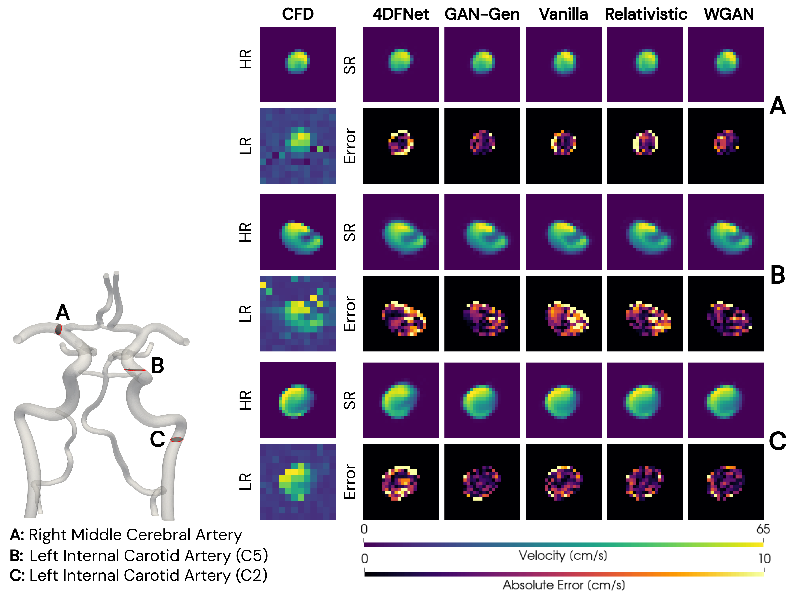
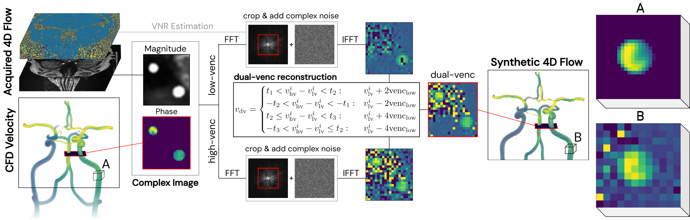

# Generative Adversarial Networks for Super-Resolution 4D Flow MRI

This repository provides the implementation and trained models accompanying the manuscript:  **"Potential and challenges of generative adversarial networks for super-resolution of intracranial 4D Flow MRI"**.  

In this study, we investigate the use of GANs for denoising and super-resolving 4D Flow MRI data. We introduce a dedicated GAN architecture for velocity field super-resolution and conduct a systematic evaluation of three commonly used adversarial loss formulations - Vanilla, Relativistic, and Wasserstein - trained and validated on synthetic 4D Flow MRI data generated from patient-specific cerebrovascular in-silico models.

   
  <b>Figure 1:</b> Low resolution (LR), high resolution (HR) and super-resolution (SR) cross-sectional slices with corresponding absolute error maps (HR vs SR) during peak systole flow.

   
  <b>Figure 2:</b> Overview of the dual-venc reconstruction and synthetic 4D Flow MRI generation process.

## Training setup

### Data Preparation

To generate pairs of HR and LR training patches, we start from a CFD dataset stored in HDF5 format. This file should contain 4D velocity fields (`u`, `v`, `w`), each defined over time, with shape `[T, X, Y, Z]`. Additionally, a 3D binary mask defining the flow field region is required.

For magnitude co-registration (see Figure 2), a separate HDF5 file `mag_templates.h5` is required, containing 4D Flow magnitude images in RAS orientation.

The full data preparation consists of:

1. **Generate low-resolution dataset**
    - Configure data paths and filenames in `prepare_data/prepare_lowres_dualvenc.py`.
    - Run the script to generate a separate HDF5 file containing the low-resolution velocity data.

2. **Extract random patches from LR-HR dataset pairs**
    - Configure data paths and filenames in `prepare_patches.py`.
    - Set `patch_size`, rotation option, and number of patches per frame.
    - Run the script to generate a CSV file containing patch coordinates.

### Training

To run a training session for 4DFlowGAN:

1. **Open GAN-trainer.py and configure the data_dir and the csv filenames**
2. **Adjust hyperparameters**
3. **Run** `GAN-trainer.py`

The main adjustable hyperparameters are listed below:

| Parameter  | Description   |
|------|--------------|
| adversarial| Which type of adversarial loss to use. Available options are 'vanilla', 'relativistic', and 'WGAN'|
| epochs_before_disc| Number of epochs before adversarial loss is activated|
| learning_rate| Learning rate |
| restore| Option to restore model from a existing set of training weights |
| learning_rate| Learning rate |
| epochs | Number of epochs |
| batch_size| Batch size per prediction |
| folder & network_name | The network folder name. The model will be saved as models/folder/name_timestamp |
| res_increase | Upsample ratio, adjustable to any integer but must comply with given HR and LR training data |
| low_resblock | Number of RRDBs in low resolution space |
| hi_resblock | Number of RRDBs in high resolution space |

### Inference

To run predictions:

1. **Open** `src/GAN-predictor.py` **and configure** `input_filename` **and** `output_filename`
2. **Specify the path to trained model weights (in HDF5 format), either from your own trained or provided pre-trained models.**
3. **Run the prediction script** `GAN-predictor.py`
4. **To evaluate prediction performance, run** `performance_metrics.py` **or** `performance_visualization.py` **. Provide the generated super-resolved file and the corresponding reference HR file to compute metrics (vNRMSE, MAE, generate regression plots etc.).**

## Pre-trained weights

Two pre-trained model weights referenced in the manuscript are available to download:

- [`GAN-WGAN-best.h5`](pre-trained_weights/GAN-WGAN-best.h5)— WGAN model trained with adversarial loss weight λ_G = 1e-3

- [`GAN-Gen.h5`](pre-trained_weights/GAN-Gen.h5) — standard GAN-Generator model trained without adversarial loss

These weights can be used directly for inference or evaluation.

## Example dataset

An example toy dataset is provided to demonstrate the workflow:
- High-resolution CFD simulation: `/data/example_data_HR.h5`
- Corresponding dual-venc downsampled low-resolution data: `/data/example_data_LR.h5`
- Pre-generated HR-LR patch csv files: `/data/train.csv` and `/data/validate.csv`

The dataset consists of one time frame from a synthetic CFD simulation of the main arteries surrounding the circle of Willis. It allows demonstration of the complete workflow on a small synthetic set intended for testing purposes.

<!-- ## Citation
If you use this repository in your research, please cite:

O. Welin Odeback et al. Potential and Challenges of Generative Adversarial Networks for Super-Resolution 4D Flow MRI. Fill in! -->

## Contact
For questions or further details, please contact me at `oliver.welin.odeback@ki.se`.

